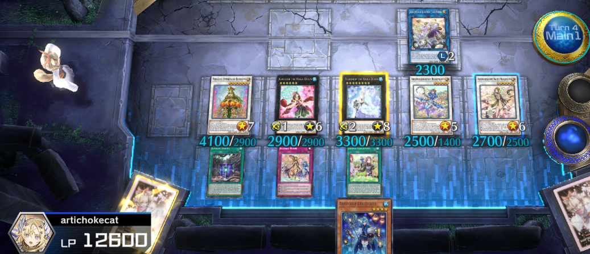

# Aaron Thai

aaron42@uw.edu 

https://aaron-thai.github.io/resume

http://www.linkedin.com/in/aaron-thai

# Summary

> Part time weeb, full time fake gamer. 
>
> (*I mostly watch YouTube, full disclaimer.*)

# Experience (last year)

## Arknights Doctor (Aethryc#3760)

*[Arknights site][] The best tower defense game.*

**Doctor Aethryc (Doktah, Dokutah)** (April 2020 - present)

Summary of role

- Hired 181 different operators
- Completed first week Risk 18 in CC4
- Defeated Patriot at stage 7-18
- Spent over 30 Originite Prime without pulling Mudrock

## Yugioh Master Duelist (593-955-642)

*[Master Duel EN site][] The official Yugioh simulator.*

**Plat V (currently Silver V)** (Feb 2022 - present)

Summary of role

- Flexed on Eldlich player with **Traptrix**.
- Sat through a Drytron player's entire turn.
- Wiped a Tri-Zoo board with Torrential Tribute.
- Pulled two copies of Geomathmech Final Sigma.

## Fortnite Gamer (uninstalled)

*[Fortnite EN site][] The best battle royale game.*

**Trio Member ("arti")** (Feb 2022 - Mar 2022)

Summary of role

- **We got a, number one Victory Royale**
- Yeah Fortnite we bout to get down
- Missed 50% of shots
- Provided the worst callouts

[Fortnite EN site]: https://www.epicgames.com/fortnite/en-US/home
[Master Duel EN site]: https://www.konami.com/yugioh/masterduel/us/en/
[Arknights site]: https://www.arknights.global/