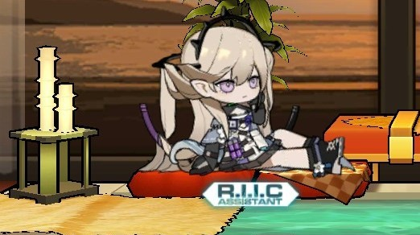
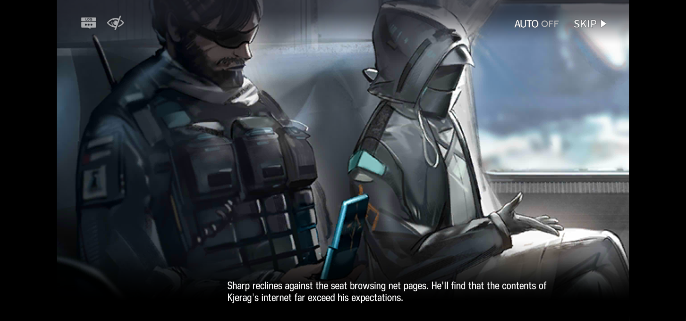
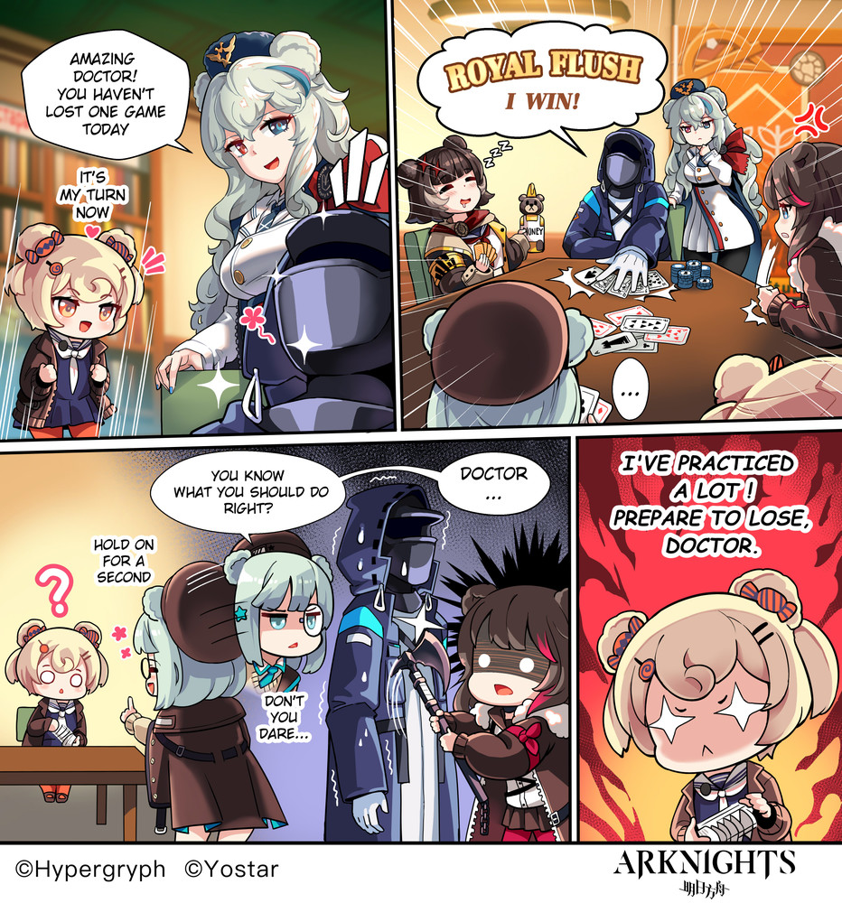
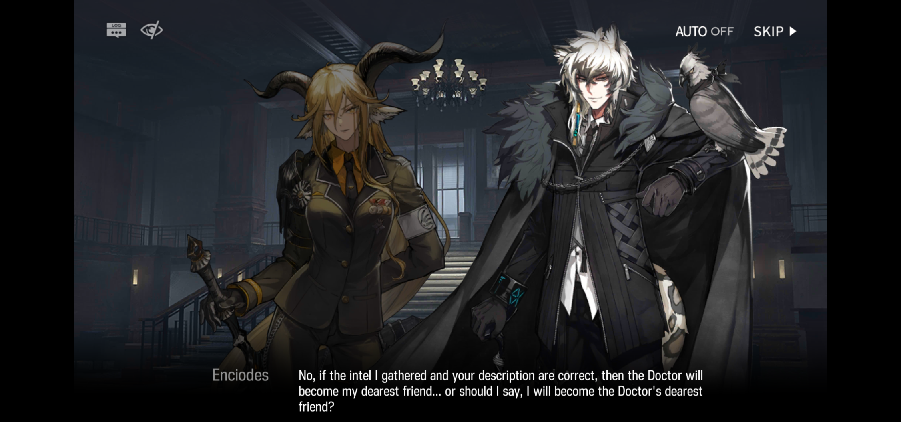
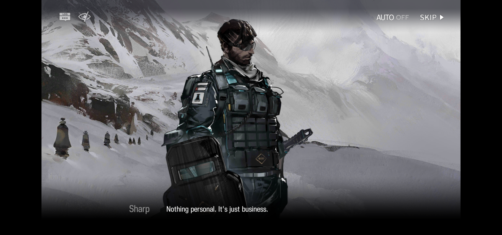
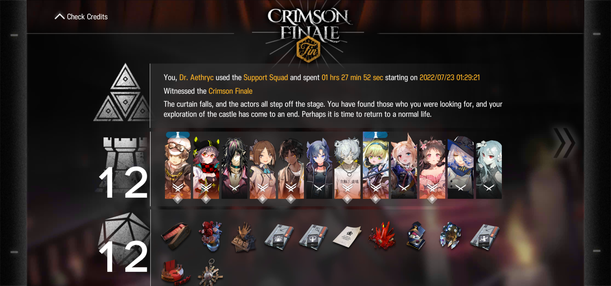
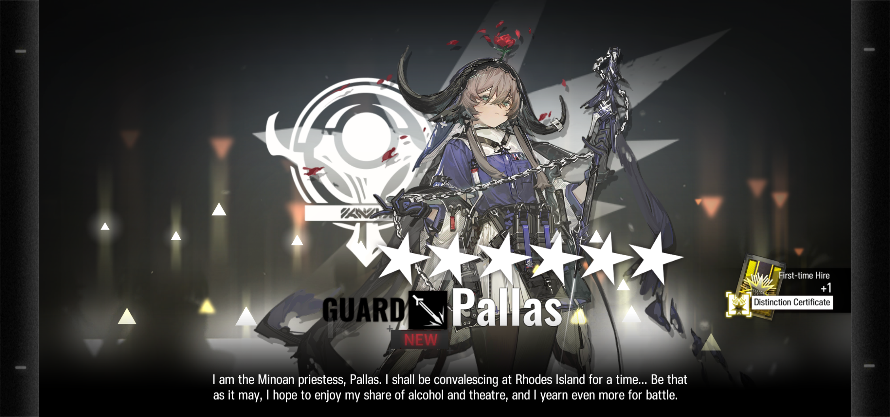
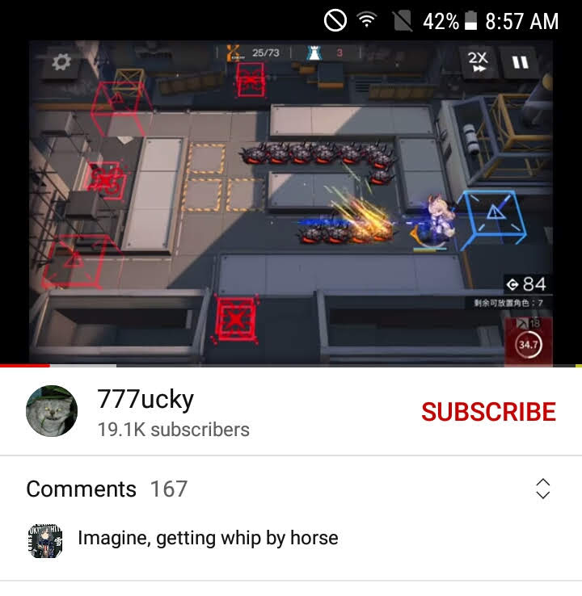
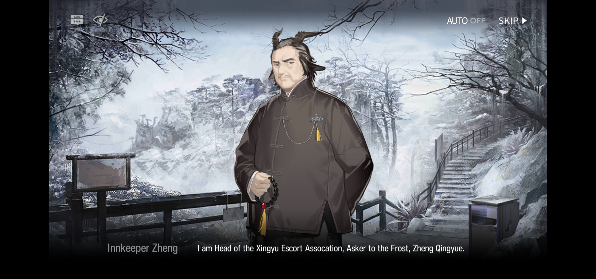

# Arknights: a Retrospective

## Introduction
 

[*Arknights*](https://www.arknights.global/) is a mobile tower defense game released on **January 16, 2020** [worldwide](https://en.wikipedia.org/wiki/Arknights).

My own *Arknights* journey started somewhere around **April 18, 2020**, and ended on **August 21, 2022**.

One of my earliest memories is watching [KyostinV's stage guides for the Obsidian Festival event](https://www.youtube.com/playlist?list=PLNgrku2z_iBn35phWtn2PMF4wUWtdc_gF), failing to clear all of the stages due to my weak team, and killing a giant volcanic slug for hours on end to obtain level-up materials.

I left the game at the peak of the Integrated Strategies 2 (IS2) release, a roguelite mode that effectively delivered infinite and novel replayable content for the game. It was *insanely addicting*, so for the sake of my own sanity I uninstalled the game, and then of course I went back to *Genshin Impact*.

However, I continue to follow the artists in Twitter and glance at the updates on YouTube. 

When the Arknights anime finally drops on **October 28**, there is a high chance that I'll be watching it. In celebration of this upcoming moment, why don't we take a small trip down memory lane?

*(This is an excuse for a review.)*

## Story
 

Arknights truly takes advantage of the "visual novel" format to literally have actual light novels worth of text. I am talking about effectively hundreds of pages of dialogue. Thankfully, the devs have added both a skip button and a fast-forward button *(16x is my favorite)* to advance the story at your own pace. *(Take notes here, Genshin devs...)*

The premise should probably be familiar to you by now but here it is:

You are **"The Doctor,"** a strategy and management *genius* working for a "pharmeceutical company" called *Rhodes Island*, looking to find a comprehensive treatment for a fatal disease called **"Oripathy"** *(alternatively called "magical rock cancer" by those in the community)*.

## Events
I've experienced a great many events in my two years playing the game. Even if I were to only choose the most memorable ones, there would still be way too many to discuss. 

### *Children of Ursus*
 

This was a traumatic reading experience so I'm glad I don't remember much of anything from it. This event details the tragic backstory of the *Ursus Student Self-Government Group* and follows a similar premise to the novel *Lord of the Flies.* 

What happens if a school is isolated from the outside world with no adults to rely on, and survival depends on a dwindling supply of food? 

Alliances are formed, enemies are made, blood is shed, and survivors are born.

### *Break the Ice*
 

This was more or less the last event I played. Ok, so even on 8x speed it still took me a few hours to get through the story. Granted, it was satisfying to finally understand the lore behind one of the most powerful starter characters.

The story can be summarized as such:

You *(The Doctor)* are going on a vacation to the remote land of *Kjerag* with your friend and business partner **Enciodes Silverash**. Joining you is your bodyguard, the Elite Operator **Sharp**, and his trainee, **Aurora**. And of course, not everything is as it seems. 

 

Silverash happens to be one of the biggest names in town there *(he effectively has control of 1/3 of the population or so)* and is pushing the local government to construct a railroad and open trade to the outside world. You inevitably get involved in the local politcal disputes, have a couple of scuffles, watch Sharp go sicko mode, and eventually everything gets sorted out. The people agree to bring in a new era, and there is hope for the future. Fantastic.

 

Yes, I did skip over A LOT of the lore about the culture and other big wigs in town, but one of the great things about the Arknights community is that there are plently of capable storytellers, who summarize the stories of the events in short videos for your viewing pleasure.

## Team Building
 

Honestly, you can probably use whoever you want and clear all of the stages. This is probably one of the many reasons why Arknights is so beloved by the community. Choose your favorite characters and as long as your brain is big enough and your patience long enough, anything is possible with the right strategy. Of course, there are many units that can trivialize difficulty if you are into that, but be prepared to gather enough resources to hire them...

## Gacha
 

Arknights is pretty tough at the start of the game. Yes, you do get a free starter 6* *(actually I even got 2 hehe)* but the amount of pull currency you have is quite stable. Every week, once your account can clear *Annihilation 3,* you will have about **5 pulls a week**. It's not especially spectacular, but it's definitely not too bad. 

Especially if you consider that a banner usually runs for two weeks, and you are guaranteed a 5* after 10 pulls. Basically, you'll have a chance to pull on every event banner that comes out if you want to. 

For **Limited Event banners** usually they are extremely generous *(just my opinion)* and will give you a free one-time 10-pull, a free pull every day on the banner, as well as login events that can possibly net you around 1-2 pulls every day. They will also ocassionally send some free stuff to your inbox as well. Overall, it's likely that you will get around 50 pulls on the banner as a f2p which is likely to net you one or more copies of the featured 5* character. *(And yes, I do have the exclusive collab character **Ash** from Rainbow Six Siege).*

## Conclusion
 

Arknights is probably overall one of the best mobile games gameplay-wise. *(It also happens to satisfy my childhood pastime of tower defense)*. 

Voice acting is also great, with English and Chinese voices also being added into the game bit by bit. 

While rate-up may or may not be a lie, the rates are usually fair *(I think there is probably some internal balancing to eventually even out the odds if you are very unlucky)*.

As a smaller franchise, I think Arknights successfully manages to embrace the idea of an international community, missing some of the controversies surrounding Genshin Impact. Nobody is ever perfect, but one of the core themes of the story is *acceptance*, which helps to build a supportive fanbase.

I don't know if I've actually left the game for good, but I think I'll always be a part of the community. 

### Featured Story Recappers
 

These YouTubers will read the story so you don't have to.
- [FrostByte262](https://www.youtube.com/channel/UCjmigXcFhjldwmVBpdLoARg) *(story recaps)*
- [CANNONLOWY ARKNIGHTS](https://www.youtube.com/channel/UCfcsf7IDU7P-1vZZZDCj4Ug) *(story clips)*
- [QaiserMLG](https://www.youtube.com/c/QaiserMLG) *(lore and theories)*

### Featured Music
It is an ongoing joke that the developers are actually running a [music label](https://monster-siren.hypergryph.com/), and that the game is actually just the advertisement. Yes, there really is an actual music label. There are too many good tracks to fit onto a shortlist, but here are a few to start. 

1. [Speed of Light (Code of Brawl PV music)](https://www.youtube.com/watch?v=L2LB12IxLDU)
2. [Operation Blade (Art of Blade)](https://www.youtube.com/watch?v=3dtEALr3L_g)
3. [Dossoles Holiday - Lobby BGM](https://www.youtube.com/watch?v=aDmwLjprRoM)

### Resources
- [Aceship's Toolbox](https://aceship.github.io/AN-EN-Tags/akgallery.html) *(character info and game CGs)*
- [Arknights GamePress](https://gamepress.gg/arknights/) *(wiki, event info, character guides)*
- [Arknights EN Twitter](https://twitter.com/ArknightsEN) *(official news)*